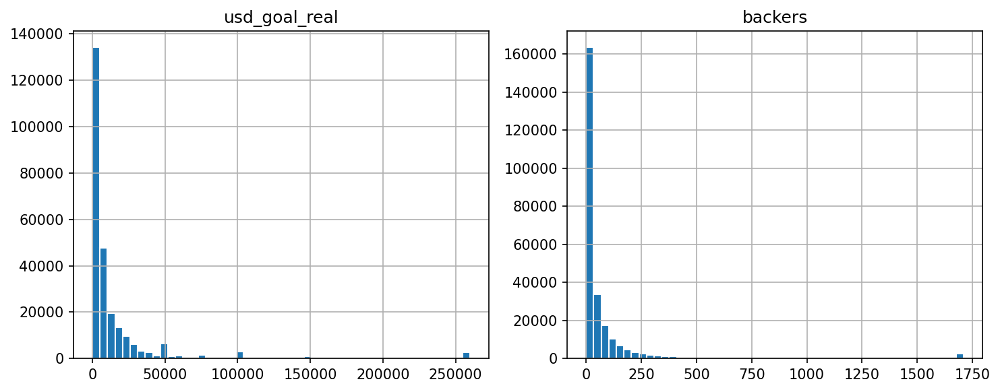
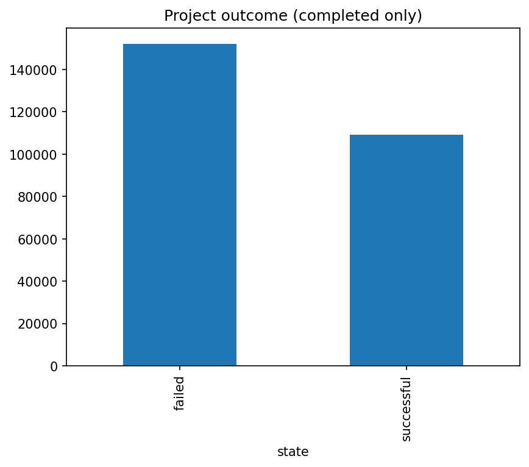
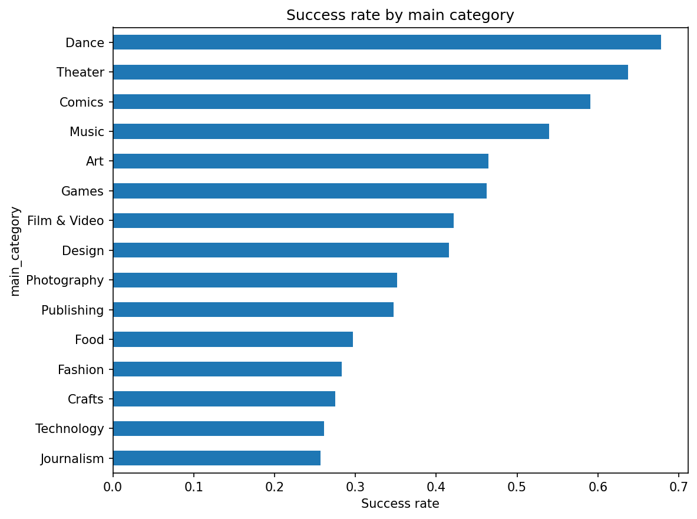
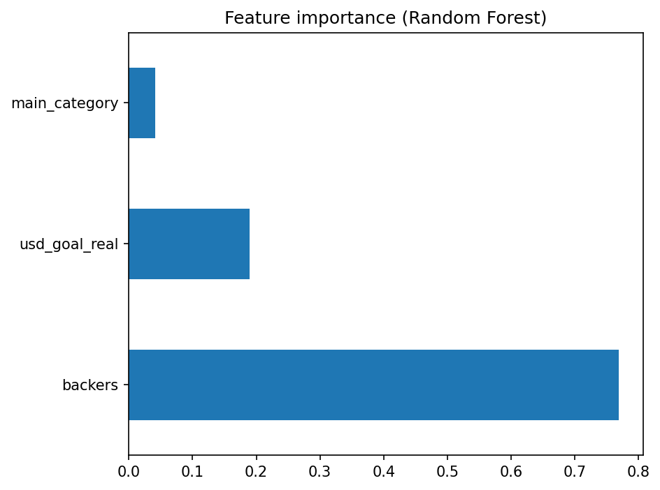

# Predicting Crowdfunding Success: US Kickstarter Campaigns (USD)

## Question

What drives Kickstarter campaign success among **US** campaigns in **USD**, and can we predict whether a project will succeed or fail using goal size, backers, and category?

## Method

I used the Kickstarter Projects dataset from Kaggle, including **both** included snapshots (`ks-projects-201612.csv` and `ks-projects-201801.csv`). I kept the raw files in `data/raw/`, and I wrote the cleaned data, data dictionary, and `snapshot_comparison.json` into `data/cleaned/`.

The analysis scope is **United States** creators and **USD** currency only, with completed outcomes (`successful` / `failed`). The 2016 file uses a different column layout than the 2018 file; the ETL script normalizes columns and aligns USD goal and pledged fields. For project ids that appear in both snapshots, the cleaned modeling table keeps **one row per id** (the **2018** row). `snapshot_comparison.json` still reports row counts and success rates **by export** after filters, which supports comparing the two snapshots at a high level.

For ETL, I applied duplicate removal, type coercion, date parsing, and the scope filters above. Those steps are implemented in `scripts/02_etl_clean.py`, and cleaning notes are captured in `data/cleaned/data_dictionary.json`.

For storage, I loaded the cleaned dataset into SQLite at `data/cleaned/kickstarter.db` (table `projects`), and I retained a cleaned CSV for analysis. I also uploaded the same cleaned dataset to **Google BigQuery**; setup is documented in `CLOUD_SETUP.md` and `scripts/05_cloud_bigquery_upload.py`. Authentication uses **Application Default Credentials** (`gcloud auth application-default login`) because organization policy blocked downloading a service account JSON key.

For EDA, I examined distributions of goal and backers, missingness, and success rate by `main_category`.

For prediction, I used features **`usd_goal_real`**, **`backers`**, and **`main_category`** (label-encoded). `country` is not used as a feature because it is fixed by the ETL filters. I trained a **baseline logistic regression** (with standardized numeric features) and an improved **Random Forest** (100 trees, `random_state=42`). I used a stratified **75% / 25%** train and test split (`random_state=42`). I evaluated both models using **accuracy**, **precision**, **recall**, **F1**, and **ROC-AUC** on the test set.

## Results

### Data scale and EDA

- **Modeling table:** 261,360 rows and 16 columns after cleaning (`notebooks/eda_and_prediction.ipynb`).
- **Outcome balance:** 109,299 `successful` vs 152,061 `failed` in the cleaned set (from `state` frequencies in the notebook).
- **Missing values:** `deadline` is entirely missing in this export after load (261,360); `name` has 2 missing values. Modeling does not use `deadline` or `name`.
- **Figures** (saved next to this report by the notebook):

| Figure | File | What it shows |
|--------|------|----------------|
| Distributions of `usd_goal_real` (log scale) and `backers` | [`distributions_goal_backers.png`](distributions_goal_backers.png) | Right-skewed goals; many campaigns with few backers |
| Outcome counts | [`distribution_state.png`](distribution_state.png) | Class imbalance (more failed than successful) |
| Success rate by `main_category` | [`success_rate_by_category.png`](success_rate_by_category.png) | Strong category effects (e.g. Dance vs Technology) |
| Random Forest feature importance | [`feature_importance.png`](feature_importance.png) | `backers` dominates; `usd_goal_real` and `main_category` contribute |

### Model metrics (test set)

Values below match the last end-to-end run of `notebooks/eda_and_prediction.ipynb` (executed with `python -m nbconvert --execute notebooks/eda_and_prediction.ipynb --inplace`).

**Baseline (Logistic Regression)**

| Metric | Value |
|--------|--------|
| Accuracy | 0.8656 |
| Precision | 0.9244 |
| Recall | 0.7384 |
| F1 | 0.8210 |
| ROC-AUC | 0.9631 |

**Improved (Random Forest, n_estimators=100)**

| Metric | Value |
|--------|--------|
| Accuracy | 0.9218 |
| Precision | 0.9029 |
| Recall | 0.9106 |
| F1 | 0.9067 |
| ROC-AUC | 0.9727 |

The Random Forest improves accuracy by about **5.6 percentage points** and balances precision/recall more evenly than the baseline, with a slightly higher ROC-AUC.

## Google BigQuery

- **GCP project ID:** `project-b5dc9446-5de1-47db-be4`
- **Dataset:** `kickstarter`
- **Table:** `projects` (~261K rows; cleaned US/USD scope)
- **Example query:** success rate by `main_category` (top categories by success %), run in BigQuery Studio.
- **Sample result row:** e.g. Dance, `n = 3081`, success rate ≈ **67.8%** (matches script or console output for that category).

Documentation: `CLOUD_SETUP.md`, README (Google BigQuery section).

## Limitations

Results apply to **US, USD** campaigns in historical Kickstarter exports, not necessarily to other countries or currencies.

The target is successful vs failed; **backers** are highly predictive but are only fully known after the campaign, so the model is best framed as **historical analysis** rather than strict pre-launch forecasting.

The merged modeling table primarily reflects the **2018** snapshot row when a project id exists in both exports; use `snapshot_comparison.json` for export-level comparison.

## Next steps

Optional: add campaign duration (`deadline` − `launched`) if `deadline` is repaired in ETL, try class weighting for imbalance, or full one-hot encoding for `main_category` instead of label encoding.
